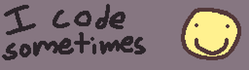

# @what-is-a-git

i do mostly game dev related stuff atm

mostly like using godot and c/c++ atm, but will work with
other stuff when needed (or if trying something new (currently other langs like rust and go))

mostly doing my own thing but sometimes i contribute
to other stuff i guess

i also have a [neocities / personal website](https://cherrythecool.neocities.org/) if you find that kind of thing interesting
(it's not very code related atm tho so keep that in mind)

¯\\\_(ツ)\_/¯
